<hr>

## **Mi web personal**
#### Autor: David Roni Hernández Beltrán
<hr>


### **Menu**


* [1) Funcionamiento](#1-funcionamiento)


* [2) Configuracion de correo gmail automatizado](#2-configuracion-de-correo-gmail-automatizado)
    * [1.1) Apartado de presentacion](#11-apartado-de-presentacion)
    * [1.2) Apartado de portafolio](#12-apartado-de-portafolio)
    * [1.3) Apartado de blog personal](#13-apartado-de-blog-personal)
    * [1.4) Apartado de contacto](#14-apartado-de-contacto)
    * [1.5) Descargar curriculum](#15-descargar-curriculum)
    * [1.5) Otros detalles](#15-otros-detalles)

* [3) Instalacion de forma local](#3-instalacion-de-forma-local)
    * [3.1) Instalacion de paquetes ](#31-instalacion-de-paquetes)
    * [3.2) Ejecutando proyecto localmente ](#32-ejecutando-proyecto-localmente)
    
* [4) Alojar la pagina en internet](#4-alojar-la-pagina-en-internet)
    * [4.1) Crear la base de datos con MySQL](#41-crear-la-base-de-datos-con-mysql)
    * [4.2) Primeras configuraciones en la consola de pythonanywhere](#42-primeras-configuraciones-en-la-consola-de-pythonanywhere)
    * [4.3) Configuraciones en el apartado web de pythonanywhere](#43-configuraciones-en-el-apartado-web-de-pythonanywhere)
    * [4.4) Ultimas configuraciones en la consola](#44-ultimas-configuraciones-en-la-consola)
    * [4.5) Ultimo paso](#45-ultimo-paso)
    * [4.6) Respaldo de los datos](#46-respaldo-de-los-datos)

* [5) Fuentes de informacion](#5-fuentes-de-informacion)


<hr>

## **1) Funcionamiento**

<div class="myWrapper" markdown="1" align="left">

[Regresar al menu principal](#menu)
</div>

<hr>


Mi web personal esta conformado por 5 apartados principalmente:

<div style="text-align: center;">

</div>


### **1.1) Apartado de presentacion**

<div class="myWrapper" markdown="1" align="left">

[Regresar al menu principal](#menu)
</div>


* El apartado de la descripcción de la persona, es aquel en donde esta puede adjuntar una foto suya y la descripcción acerca de si misma, su vida, sus logros, sus perfiles,etc.Toda esa información la adjunta y edita la persona  desde el sistema de administración de django.


<div style="text-align: center;">

</div>


### **1.2) Apartado de portafolio**

<div class="myWrapper" markdown="1" align="left">

[Regresar al menu principal](#menu)
</div>


* El apartado de portafolio, es aquel en donde se podran viualizar los proyectos, especializaciones, cursos impartidos, cursos tomados y experiencia laboral de la persona, es importante mencionar que esta apartado solo muestra un determinado conjunto de cada cosa mencionada, para no sobrecargar al servidor sin embargo ofrece un link para ver todos los elementos de cada cosa mencionada.Es importante mencionar que los datos que se muestran en este apartado son elegidos y editados por la persona del sitio web  desde el sistema de administración de django.
 

<div style="text-align: center;">

</div>


Este apartado te dirige a mas apartados, por ejemplo:

* Te da la opcción de ver todos los proyectos de la persona del sitio web, unicamente se debera hacer clic  a un link para ver todos los proyectos,sin embargo tambien es cuidadoso con no sobrecargar al servidor por medio de la paginación.
    * Dando clic sobre el nombre del proyecto, se redigira a la descripcción de este.


<div style="text-align: center;">

</div>


* Te da la opcción de ver todas las especializaciones de la persona del sitio web, unicamente se debera hacer clic  a un link para ver todas las especializaciones, sin embargo tambien es cuidadoso con no sobrecargar al servidor por medio de la paginación.
    * Dando clic sobre el nombre de una especialiación, se redigira a la descripcción de esta y tambien ofrecera la opción de ver el certificado de la persona para validar que la especialización es valida.

<div style="text-align: center;">

</div>


* Te da la opcción de ver todos los cursos impartidos de la persona del sitio web, unicamente se debera hacer clic  a un link para ver todos los cursos impartidos, sin embargo tambien es cuidadoso con no sobrecargar al servidor por medio de la paginación.
    * Dando clic sobre el nombre del curso impartido, se redigira a la descripcción de este y tambien ofrecera la opción de ver el certificado de la persona para validar que el curso impartido es valido.

<div style="text-align: center;">

</div>


* Te da la opcción de ver todos los cursos tomados  de la persona del sitio web, unicamente se debera hacer clic  a un link para ver todos los cursos tomados, sin embargo tambien es cuidadoso con no sobrecargar al servidor por medio de la paginación.**UNA PECULARIADIDA DE ESTO ES QUE OFRECE UNA SISTEMA DE BUSQUEDA POR CATEGORIAS DE LOS CERTIFICADOS ASI COMO BUSQUEDA POR PALABRA CLAVE, ESTO CON LA FINALIDAD DE QUE UN RECLUTADOR QUE VISITE EL SITIO WEB PUEDA FACILAMENTE VER QUE CERTIFICADOS TIENE LA PERSONA RELACIONADOS CON EL TEMA O TEMAS DE INTERES DEL RECLUTADOR.**
    * Dando clic sobre el nombre del curso tomado, se redigira a la descripcción de este y tambien ofrecera la opción de ver el certificado de la persona para validar que el curso tomado es valido.

<div style="text-align: center;">

</div>

### **1.3) Apartado de blog personal**

<div class="myWrapper" markdown="1" align="left">

[Regresar al menu principal](#menu)
</div>


* El apartado de blog personal que es aquel en donde se visualizaran todos los articulos publicados por el autor, es importante mencionar que dicho apartado ofrece una busqueda por categorias de los articulos asi como tambien un busqueda por nombre para que el usuario o reclutador pueda encontrar mas facilmente los temas de su interes o el articulo que busca especificamente.

<div style="text-align: center;">

</div>


### **1.4) Apartado de contacto**

<div class="myWrapper" markdown="1" align="left">

[Regresar al menu principal](#menu)
</div>


* El apartado de contacto que es aquel donde el reclutador o el usuario que visite el sitio web de la persona pueda contactarse con la persona a traves de un mensaje de correo electronico, ¿pero como funciona esto exactamente? Bueno  dicho apartado le pedira al reclutador o usuario que ingrese su correo,su nombre y mensaje, y tambien tendra un boton con la leyenda de **<< ENVIAR >>** que cuando se precione, el mensaje se le mandara automaticamente al correo electronico de la persona del sitio web, dicho correo es el que se especifica en el sistema de administración de django, tambien se le mandara un mensaje de  al reclutador o usuario informandoles que su mensaje fue mandado con exito a la persona del sitio web. ¿y cual es el mensaje que le enviara al reclutador o usuario? bueno ese mensaje de confirmación la persona del sitio web debera definirlo en el sistema de administración de django.

<div style="text-align: center;">

</div>


### **1.5) Descargar curriculum**

* El boton que al dar clic en el se abrira el curriculum de la persona en formato pdf para que el usuario o reclutador pueda descargarlo si asi lo deseara.

<div style="text-align: center;">

</div>


### **1.6) Otros detalles**

<div class="myWrapper" markdown="1" align="left">

[Regresar al menu principal](#menu)
</div>


¿Que mas ofrece me web personal?

Bueno en el pie de pagina ofrece los diferentes medios de contacto de la persona, los medios de contactos que ofrece son los que la persona haya ingresado en el sistema de administración de django, estos pueden ser:
* Su correo electronico
* Su repositorio github
* Su likedin
* Su numero telefonico
* Entre otros mas.

<div style="text-align: center;">

</div>


¿Que otras peculiaridades ofrece la web personal?

Bueno, desde el sistema de administración de django le permite a la persona del sitio web cambiar la imagen de portada de cada apartado de esta, con el objetivo que este le de el estilo que desee.

<div style="text-align: center;">

</div>


<hr>

## **2) Configuracion de correo gmail automatizado**

<div class="myWrapper" markdown="1" align="left">

[Regresar al menu principal](#menu)
</div>

<hr>


En el sitio web que desarrolle cuando una persona quiera contactarse contigo, habra una respuesta automatica a dicha persona, dicha respuesta automatica sera mandada por el correo de gmail que se adjunte en el archivo **<<secret.json>>**, para crear dicho correo de gmail que sera el encargado de automatizar la mensajeria se debera hacer lo siguiente:

Primero se debera crear una cuenta de gmail, y se debera activar la atentificación de dos pasos por medio del numero telefonico.Una vez hecho lo anterior  se debera ir al apartado de: **<< cuenta >>** :

<div style="text-align: center;">

</div>

Despues se debera ir al apartado de **<< seguridad >>**

<div style="text-align: center;">

</div>

Y generar una contraseña para la aplicación web, esto se hace haciendo lo siguiente:

<div style="text-align: center;">
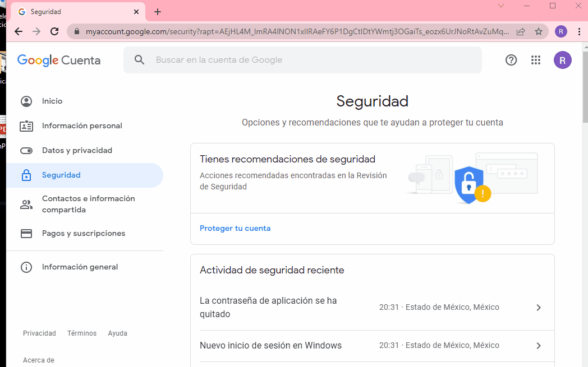
</div>

**ES IMPORTANTE MENCIONAR QUE  DICHA CONTRASEÑA DEBE SER GUARDADA POR QUE SERA UTILIZADA EN EL ARCHIVO 'secret.json' AL  AL IGUAL QUE EL CORREO ELECTRONICO TAMBIEN SERA UTILIZADO**


<hr>

## **3) Instalacion de forma local**

<hr>

El primer paso es decargar el codigo fuente del proyecto, una vez hecho lo anterior el segundo paso sera la instalación de los paquetes necesarios.


### **3.1) Instalacion de paquetes**

<div class="myWrapper" markdown="1" align="left">

[Regresar al menu principal](#menu)
</div>

Para poder ejecutar el programa es necesario tener python 3 instalado, asi como
tambien instalar los siguientes paquetes:

* Pillow>=9.0.0
* Django>=3.2.11
* django-ckeditor==6.2.0  
* django-model-utils==4.2.0

Los nombres de dichos paquetes se encuentran en: <<requeriments/local.txt>> da clic izquierdo [aqui para ver el archivo](requeriments/local.txt)


Recomendación: Instalar los paquetes  en un **virtualenv** la cual  es una herramienta para crear entornos Python aislados, con el fin de evitar problemas  de dependencias y versiones, si desea consultar información de como instalar un entorno virtual recomiendo el siguiente link: https://docs.python.org/es/3/tutorial/venv.html

A continuación se muestra como poder instalar los paquetes antes mencionados:

### Windows
* **Alternativa numero 1:** Instalar cada paquete de forma individual

    * Instalando  una version de Pillow compatible:
        <pre><code>pip3 install Pillow>=9.0.0</code></pre>

    * Instalando una version de Django compatible:

        <pre><code>pip3 install Django>=3.2.11</code></pre>

    * Instalando la versión de ckeditor que me funciono

        <pre><code>pip3 install django-ckeditor==6.2.0 </code></pre>

    * Instalando models utils:

        <pre><code>pip3 install django-model-utils==4.2.0</code></pre>


* **Alternativa numero 2:** Instalar todos los paquetes con ayuda del archivo **requirements**

Dado que la instalación de los paquetes es para ejecutar la web personal localmente, entonces el archivo
de requeriments correspondiente es el que se encuentra en <<requeriments/local.txt>>, da clic izquierdo [aqui para ver el archivo](requeriments/local.txt).Una vez ubicado el archivo de requeriments correspondiente se debera hacer lo siguiente:

<pre><code> pip3 install -r local.txt</code></pre>


### **3.2) Ejecutando proyecto localmente**

<div class="myWrapper" markdown="1" align="left">

[Regresar al menu principal](#menu)
</div>


Una vez terminados de instalar los paquetes se debera ir a la carpeta que contiene el archivo **<< manage.py >>** de mi web personal 

<div style="text-align: center;">
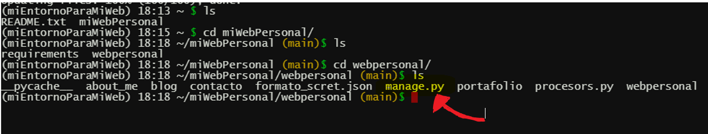
</div>

```
├── webpersonal
│   ├── about_me
│   │   ├── ...
│   │   ├── ...
│   │   ├── ...
│   ├── blog
│   │   ├── ...
│   │   ├── ...
│   │   ├── ...
│   ├── ...
│   │   ├── ...
│   │   ├── ...
│   │   ├── ...
│   │   ├── ...
│   ├── ...
│   │   ├── ...
│   │   ├── ...
│   │   ├── ...
│   │   ├── ...
│   ├── webpersonal
│   │   ├── ...
│   │   ├── ...
│   │   ├── ...
│   ├── processors.py
│   ├── formato_scret.json
│   ├── manage.py     <========================
```

Y hacer una copia del archivo: **<< formato_scret.json>>** con el nombre de: **<< secret.json >>**, dicha copia debera almacenarse en la carpeta que almacena el archivo **<< manage.py >>**, una vez hecho lo anterior debera editarse dicha copia en los siguientes datos:


```
{
                                .
    "SECRET_KEY": "ES LA QUE GENERA DJANGO EN EL AARCHIVO DE SETTINGS",
                                .
                                .
                                .
                                . 
    "EMAIL":"EMAIL QUE MANDARA EL CORREO DE CONTACTO AL USUARIO Y AL AUTOR",
    "EMAIL_PASSWORD":"CONTRASEÑA DEL EMAIL"
}
```

Los  datos correspondientes del email son los que se explican en el partado: **[2) Configuracion de correo gmail automatizado](#2-configuracion-de-correo-gmail-automatizado)**


Ahora deberan crearse las tablas en la base de datos, es decir crearse las migraciones, esto se consigue con los siguientes comandos:

Primero ejecutar el siguiente comando: 

<pre><code>python3 manage.py makemigrations</code></pre>

Ahora ejecutar el siguiente comando es:

<pre><code>python3 manage.py migrate</code></pre>

<div style="text-align: center;">

</div>

Una vez hecho todo lo anterior lo unico que faltara es crear un super usuario en la consola de pythonanywhere con el siguiente comando:

<pre><code>python3 manage.py createsuperuser</code></pre>

Una vez hecho lo anterior ya estara listo el proyecto para ser ejecutado localmente con ayuda del siguiente comando

<pre><code>python3 manage.py runserver</code></pre>


<hr>

## **4) Alojar la pagina en internet**

<div class="myWrapper" markdown="1" align="left">

[Regresar al menu principal](#menu)
</div>

<hr>


El primer paso sera  crear una cuenta en pythonanywhere:
https://www.pythonanywhere.com  


### **4.1) Crear la base de datos con MySQL**

<div class="myWrapper" markdown="1" align="left">

[Regresar al menu principal](#menu)
</div>

Una vez creada la cuenta de pythonanywhere se debera ir al siguiente apartado:

<div style="text-align: center;">
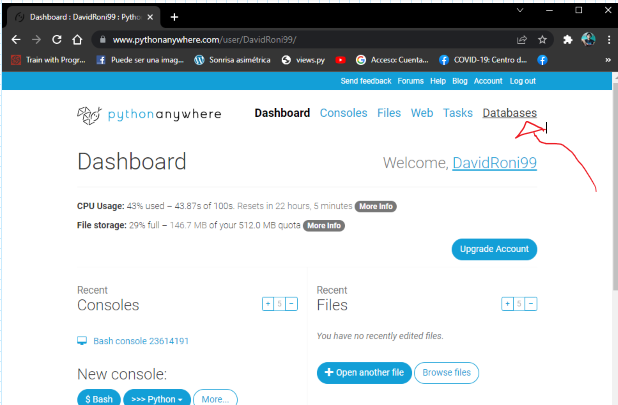
</div>

Al hacer clic en dicho apartado se debera elegir **<< MySQL >>**, despues se pedira que proporcione una contraseña para el acceso a la base de datos, una vez proporcionada dicha contraseña, se apareceran los siguientes datos de: 

* Dirección del host de la base de datos
* Nombre de usuario
* Nombre de la base de datos

<div style="text-align: center;">

</div>

En la imagen anterior se puede ver claramente que los datos proporcionados son los siguientes:

* **HOST** (Dirección del host de la base de datos): **DavidRoni99.mysql.pythonanywhere-services.com**
* **USER** (Nombre de usuario): **DavidRoni99**
* **DB_NAME**(Inicie una consola en): **DavidRoni99$default**

**ES IMPORTANTE MENCIONAR QUE ESTOS DATOS SERAN UTILIZADOS POSTERIORMENTE**


### **4.2) Primeras configuraciones en la consola de pythonanywhere**

<div class="myWrapper" markdown="1" align="left">

[Regresar al menu principal](#menu)
</div>


* Una vez creada la cuenta deberemos abrir una consola y crear un entorno virtual con ayuda del siguiente comando.

<pre><code>mkvirtualenv --python=python3.7 miEntornoParaMiWeb</code></pre>

**Observación-. El entorno se creo con python 3.7, sin embargo tu puedes elegir otra versión de python**


<div style="text-align: center;">

</div>

* Para ver que la versión de python que seleccionaste fue cargada exitosamente bastara con usar el siguiente comando:

<pre><code>python -V</code></pre>

<div style="text-align: center;">

</div>

* Ahora se debera clonar mi  proyecto con ayuda del siguiente comando

<pre><code>git clone https://github.com/RoniHernandez99/miWebPersonal.git </code></pre>

<div style="text-align: center;">
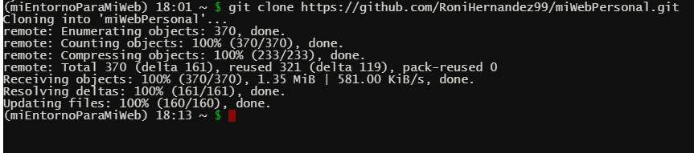
</div>

* Una vez clonado el proyecto se podra visualizar que se descargo un carpeta con el nombre de: **<< miWebPersonalv>>**

<div style="text-align: center;">
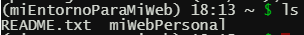
</div>


Ahora lo que debera hacer es entrar a la carpeta: **<< miWebPersonal>>** despues entrar a la carpeta: **<< requirements >>**
e instalar los paquetes que se encuentran en el archivo con el nombre de: **<< prod.txt >>**, para este ejemplo se instalaran dichos paquetes con el siguiente comando:

<pre><code>pip3 install -r prod.txt</code></pre>

sin embargo igual se pueden instalar los paquetes 1 por 1.

<div style="text-align: center;">
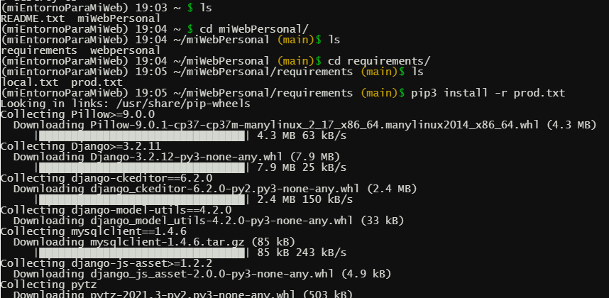
</div>

Una vez terminados de instalar los paquetes se debera ir a la carpeta que contiene el archivo **<< manage.py >>** de mi web personal 

<div style="text-align: center;">

</div>

```
├── webpersonal
│   ├── about_me
│   │   ├── ...
│   │   ├── ...
│   │   ├── ...
│   ├── blog
│   │   ├── ...
│   │   ├── ...
│   │   ├── ...
│   ├── ...
│   │   ├── ...
│   │   ├── ...
│   │   ├── ...
│   │   ├── ...
│   ├── ...
│   │   ├── ...
│   │   ├── ...
│   │   ├── ...
│   │   ├── ...
│   ├── webpersonal
│   │   ├── ...
│   │   ├── ...
│   │   ├── ...
│   ├── processors.py
│   ├── formato_scret.json
│   ├── manage.py     <========================
```

Y hacer una copia del archivo: **<< formato_scret.json>>** con el nombre de: **<< secret.json >>**, eso se logra con el siguiente comando:

<pre><code>cp formato_scret.json secret.json</code></pre>

Una vez hecha dicha copia, esta debera editarse y colocar en cada apartado los datos correspondientes a: **el correo que creaste en el punto 2.2** y a la **base de datos con MySQL que se creo en el punto 2.3**, para editar dicho archivo se debera usar el siguiente comando:

<pre><code>nano secret.json</code></pre>

Una vez terminado de editar debera guardarse y salir, esto se logra tecleando **<< control x >>** y despues confirmando que si se desean guardar los cambios antes de salir.

Ahora debera editar el archivo **<< settings.py >>**, partiendo que estamos ubicados en la misma carpeta en la que se encuentra el archivo **<< manage.py >>**, entonces la ruta relativa del archivo **<< settings.py >>** es la siguiente: **<< /webPersonal/settings.py>>**


```
├── webpersonal
│   ├── about_me
│   │   ├── ...
│   │   ├── ...
│   │   ├── ...
│   ├── blog
│   │   ├── ...
│   │   ├── ...
│   │   ├── ...
│   ├── ...
│   │   ├── ...
│   │   ├── ...
│   │   ├── ...
│   │   ├── ...
│   ├── ...
│   │   ├── ...
│   │   ├── ...
│   │   ├── ...
│   │   ├── ...
│   ├── webpersonal
│   │   ├── asgi.py
│   │   ├── settings.py <========================
│   │   ├── urls.py
│   │   ├── wsgi.py
│   ├── processors.py
│   ├── formato_scret.json
│   ├── manage.py    
```


Por tal motivo para editarlo bastara con hacer lo siguiente:

<pre><code>nano webpersonal/settings.py</code></pre>

Una vez abierta la edición del archivo **<< settings.py >>** lo que se debera hacer es comentar la configuración del gestor de base de datos sqlite y descomentar la configuración del gestor de base de datos mysql, esto se consigue haciendo lo siguiente:

<div style="text-align: center;">

</div>


Una vez mas se debera abrir la edición del archivo **<< settings.py >>** y ahora lo que se debera hacer es descomentar la linea siguiente:

```
# STATIC_ROOT=os.path.join(BASE_DIR,'static')   
```

<div style="text-align: center;">

</div>


Ahora deberan crearse las tablas en la base de datos, es decir crearse las migraciones, esto se consigue con los siguientes comandos:

Primero ejecutar el siguiente comando: 

<pre><code>python3 manage.py makemigrations</code></pre>

<div style="text-align: center;">
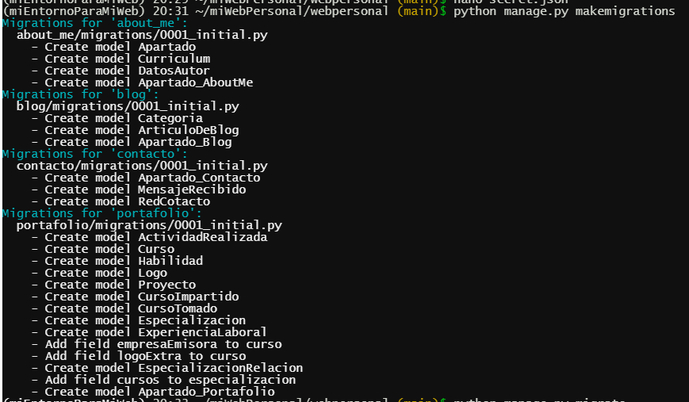
</div>

Ahora ejecutar el siguiente comando, el cual resultara algo tardado en terminar de ejecutarse(aproximadamente 45 minutos o mas):


<pre><code>python manage.py migrate</code></pre>

<div style="text-align: center;">

</div>


### **4.3) Configuraciones en el apartado web de pythonanywhere**

<div class="myWrapper" markdown="1" align="left">

[Regresar al menu principal](#menu)
</div>


Una vez hecho todo lo anterior se debera ir al apartado: **<< web >>**

<div style="text-align: center;">

</div>


Se debera dar clic en lo siguiente:

<div style="text-align: center;">
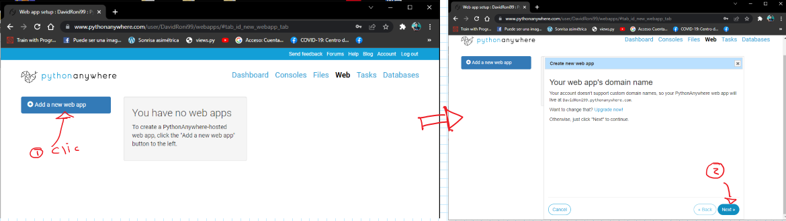
</div>

Ahora se debera dar clic sobre la opción: **Manual configuration(including virtualenvs)** despues se debera dar clic sobre la opción: **Python 3.7** ya que fue el que instalamos en el entorno virtual que creamos en el paso **2.3** y finalmente se debera dar clic sobre **Next**

<div style="text-align: center;">

</div>

Una vez hecho lo anterior, en el siguiente apartado que se encuentra en la misma pagina:

<div style="text-align: center;">
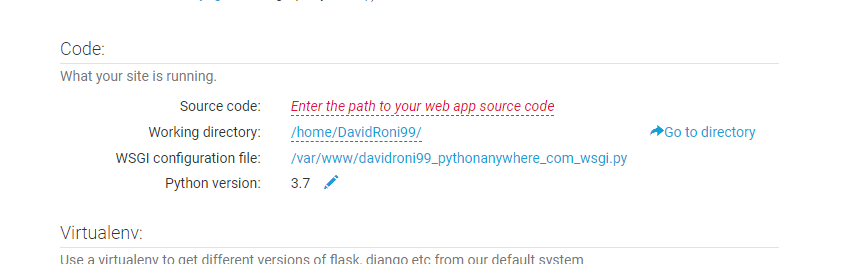
</div>

* En la parte de **<< Source code >>** se debera poner la dirección absoluta en donde se encuentra alojada la carpeta que almacena el archivo **<< manage.py >>**

* En la parte de **<< Working directory >>** se debera poner la dirección absoluta en donde se encuentra alojada la carpeta que almacena el archivo **<< manage.py >>**

Pero... ¿como obtengo la direccion absoluta de la carpeta en donde se encuentra el archivo **<< manage.py >>**

R: Bueno pues debera irse a la consola y dirigirse a dicha carpeta y despues teclar el siguiente comando:

<pre><code>pwd</code></pre>

<div style="text-align: center;">
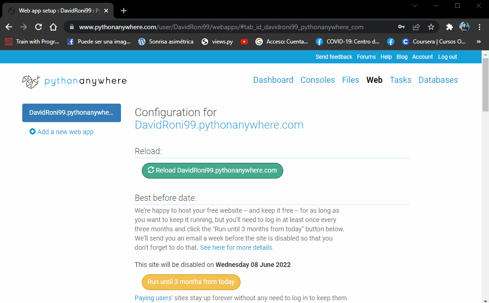
</div>


Ahora se debera dar clic sobre lo siguiente:

<div style="text-align: center;">

</div>

Al hacer lo anterior se desplegara una ventana con codigo fuente, dicho codigo fuente debera ser eliminado completamente, y despues ser remplazado  por el codigo que viene en la documentación de pythonanyhere el cual se encuentra en el siguiente link: https://help.pythonanywhere.com/pages/FollowingTheDjangoTutorial/ 

A continuación adjunto la imagen del codigo que viene en la documentación de pythonanywhere y que es el que se debe copiar:

<div style="text-align: center;">

</div>

Una vez copiado el codigo deberan editarse las siguientes partes:

<div style="text-align: center;">

</div>

* El primer cambio es por que se debe poner la ruta en donde se encuentra almacenada la carpeta que almacena el archivo **<< settings.py >>**
* El segundo cambio es por que se debe poner el nombre del archivo **<< settings.py >>** del sitio web.


Una vez hecho lo anterior, en el siguiente apartado que se encuentra en la misma pagina:

<div style="text-align: center;">
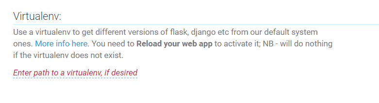
</div>

* En la parte de **<< Enter path to a virtualenv if desired >>** se debera poner la dirección absoluta en donde se encuentra alojada el entorno virtual ya creado

Pero... ¿como obtengo la direccion absoluta en donde se encuentra alojado el entonor virtual que se creo? 

R: Bueno pues debera irse a la consola y escribir el siguiente comando

<pre><code>which python</code></pre>

**LA DIRECCION QUE RETORNA EL COMANDO, NO ES EXACTAMENTE LA DIRECCION EN DONDE SE ENCUENTRA ALOJADO EL ENTONOR VIRTUAL, SIN EMBARGO PARA OBTENER DICHA DIRECCIÓN BASTARA CON ELIMINAR LA PARTE: <</bin/python >> DE LA DIRECCION RETORNADA POR EL COMANDO.**

A continuación se muestra como hacer lo mencionado anteriormente:

<div style="text-align: center;">

</div>


Una vez hecho lo anterior, en el siguiente apartado que se encuentra en la misma pagina:

<div style="text-align: center;">

</div>

* En la parte de **<< Enter URL >>** se debera poner **<< /static/ >>**
* En la parte de **<< Enter path >>** se debera poner la dirección absoluta en donde se encuentra alojada la carpeta que almacena el archivo **<< manage.py >>** pero... agregando: **<< /media/ >>**  al ultimo de dicha direccion. 

Ahora se volvera a repetir lo anterior pero en el siguiente renglon y con los siguientes valores:

* En la parte de **<< Enter URL >>** se debera poner **<< /media/ >>**
* En la parte de **<< Enter path >>** se debera poner la dirección absoluta en donde se encuentra alojada la carpeta que almacena el archivo **<< manage.py >>** pero... agregando: **<< /media/ >>**  al ultimo de dicha direccion. 


No olvidar que para obtener la direccion absoluta de la carpeta en donde se encuentra el archivo **<< manage.py >>** se debera ir a la consola y dirigirse a dicha carpeta y despues teclar el siguiente comando:

<pre><code>pwd</code></pre>


A continuación se muestra como hacer lo anteriormente mencionado

<div style="text-align: center;">

</div>


### **4.4) Ultimas configuraciones en la consola**

<div class="myWrapper" markdown="1" align="left">

[Regresar al menu principal](#menu)
</div>

Una vez hecho todo lo anterior como ultimos pasos debera irse a la consola y ubicarse en la carpeta en donde se encuentra el archivo **<< manage.py >>** e ingresar el siguiente comando:

<pre><code>python3 manage.py collectstatic</code></pre>


<div style="text-align: center;">
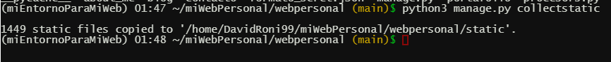
</div>


Ahora por ultimo se debera editar el archivo **<< settings.py >>**, partiendo que estamos ubicados en la misma carpeta en la que se encuentra el archivo **<< manage.py >>**, entonces la ruta relativa del archivo **<< settings.py >>** es la siguiente: **<< /webPersonal/settings.py>>**


```
├── webpersonal
│   ├── about_me
│   │   ├── ...
│   │   ├── ...
│   │   ├── ...
│   ├── blog
│   │   ├── ...
│   │   ├── ...
│   │   ├── ...
│   ├── ...
│   │   ├── ...
│   │   ├── ...
│   │   ├── ...
│   │   ├── ...
│   ├── ...
│   │   ├── ...
│   │   ├── ...
│   │   ├── ...
│   │   ├── ...
│   ├── webpersonal
│   │   ├── asgi.py
│   │   ├── settings.py <========================
│   │   ├── urls.py
│   │   ├── wsgi.py
│   ├── processors.py
│   ├── formato_scret.json
│   ├── manage.py    
```

Por tal motivo para editarlo bastara con hacer lo siguiente:

<pre><code>nano webpersonal/settings.py</code></pre>

Una vez abierta la edición del archivo **<< settings.py >>** lo que se debera hacer es:
* Cambiar el valor de: **<< DEBUG=False>>** a **<< DEBUG=True>>** 
* Agregar en la variable: **<< ALLOWED_HOSTS=[  ] >>** el nombre del dominio que nos asigno pythonanywhere, este nombre se podra ver  en el apartado: **<< web >>**.A mi pythonanywhere me asigno el nombre de dominio: **<< DavidRoni99.pythonanywhere.com >>** por lo que mi modificación deberia quedar asi: **<< ALLOWED_HOSTS=[ 'DavidRoni99.pythonanywhere.com '  ] >>**

Una vez terminado de editar debera guardarse y salir, esto se logra tecleando **<< control x >>** y despues confirmando que si se desean guardar los cambios antes de salir.


A continuación muestro como hacer lo anteriormente mencionado

<div style="text-align: center;">

</div>


### **4.5) Ultimo paso**

<div class="myWrapper" markdown="1" align="left">

[Regresar al menu principal](#menu)
</div>

Antes de por fin ver nuestro sitio web alojado funcionando correctamen se debera ir al apartado: **<< web >>** y dar clic sobre el boton de color verde que tiene la leyenda de : **<< Reload... >>**, una vez hecho lo anterior, ya podra visitarse el sitio web:

<div style="text-align: center;">
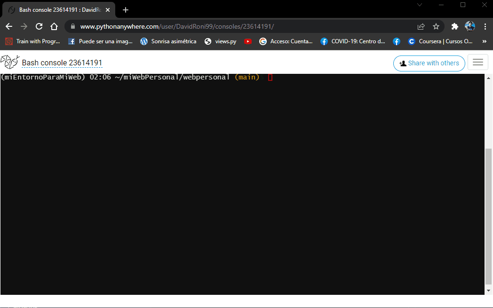
</div>


Finalmente para poder agregar contendio al sitio web personal se debera crear un super usuario en la consola de pythonanywhere y finalmente inciar sesión con dicho usuario en el sistema de administración de django del sitio web, a continuación se mostrara como hacer lo mencionado anteriormente:

<div style="text-align: center;">

</div>


### **4.6) Respaldo de los datos**

<div class="myWrapper" markdown="1" align="left">

[Regresar al menu principal](#menu)
</div>


Debera abrirse la consola en pythonanywhere y ubicarse dentro de la carpeta en donde esta alojado el archivo **<<manage.py>>**

<div style="text-align: center;">
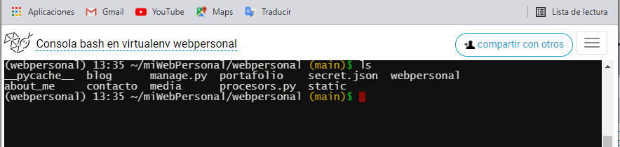
</div>

```
├── webpersonal
│   ├── about_me
│   │   ├── ...
│   │   ├── ...
│   │   ├── ...
│   ├── blog
│   │   ├── ...
│   │   ├── ...
│   │   ├── ...
│   ├── contacto
│   │   ├── ...
│   │   ├── ...
│   │   ├── ...
│   ├── media
│   │   ├── ...
│   │   ├── ...
│   │   ├── ...
│   ├── portafolio
│   │   ├── ...
│   │   ├── ...
│   │   ├── ...
│   ├── static
│   │   ├── ...
│   │   ├── ...
│   │   ├── ...
│   ├── webpersonal
│   │   ├── ...
│   │   ├── ...
│   │   ├── ...
│   ├── secret.json
│   ├── processors.py
│   ├── manage.py     <========================>
```

Una vez ubicado hecho lo anterior debera escribirse el siguiente comando:

<pre><code>python3 manage.py dumpdata --natural-foreign --natural-primary -e contenttypes -e auth.Permission --indent 2 > respaldoDeMisDatos.json </code></pre>


Al hacer lo anterior podremos ver que se creo un archivo cuyo nombre es: **<<respaldoDeMisDatos.json>>** dicho archivo es el que contiene todos los datos de la base de datos del proyecto.


<div style="text-align: center;">
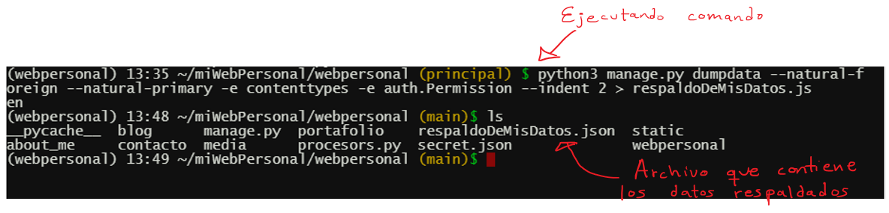
</div>


Es importante mencionar que los archivos media tales como imagenes,archivos pdf,etc tambien deben ser respaldados, para hacer ello se debera descargar la carpeta cuyo nombre es **<< media >>** sin embargo para descargala primero debera comprimirse lo cual se hace con el siguiente comando:


<pre><code>zip -r respaldoDeMisArchivosMedia media </code></pre>


Al hacer lo anterior se comprimiran todos los archivos contenidos en la carpeta media:

<div style="text-align: center;">
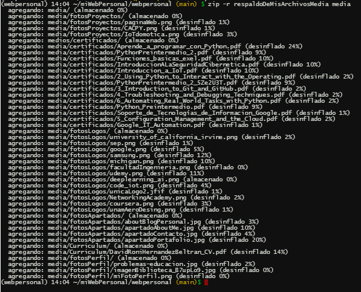
</div>

Cuando se terminen de comprimir todos los archivos podremos ver un archivo cuyo nombre es: **<<respaldoDeMisArchivosMedia.zip>>**, dicho archivo es el que contiene todos los archivos media tales como imagenes y archivos pdf.

Una vez hecho todo lo anterior deberan descargarse los archivos generados, es decir los archivos cuyos nombres son:

* respaldoDeMisDatos.json
* respaldoDeMisArchivosMedia.zip

Para hacer lo anterior debera irse al apartado de **<< archivos>>** de pythonanywhere y hacer lo siguiente:

<div style="text-align: center;">

</div>

Una vez hecho lo anterior ya estaran respaldados todos los datos del sitio web en esos dos archivos.

¿Como cargar los datos respaldados en mi web personal si es totalmente nueva?

Bueno se debera ir a la carpeta en donde esta alojado el archivo **<<manage.py>>** y copiar el archivo **<< respaldoDeMisDatos.json >>**. Una vez hecho lo anterior  ahora se debera ir a la linea de comandos, despues ubicar en la carpeta en donde esta el archivo **<<manage.py>>** y finalmente  usar el siguiente comando:

<pre><code>python3 manage.py loaddata respaldoDeMisDatos.json</code></pre>

Por ultimo de igual manera en la carpeta en donde esta alojado el archivo **<<manage.py>>** se debera copiar el archivo **<<respaldoDeMisArchivosMedia.zip>>** y descomprimirlo.

Una vez hecho lo anterior ya podran borrarse los archivos **<<respaldoDeMisArchivosMedia.zip>>**  y **<<respaldoDeMisDatos.json >>** que se encuentra en la carpeta en donde esta alojado el archivo **<<manage.py>>** 


<hr>

## **5) Fuentes de informacion**

<div class="myWrapper" markdown="1" align="left">

[Regresar al menu principal](#menu)
</div>

<hr>


* https://www.coderedcorp.com/blog/how-to-dump-your-django-database-and-load-it-into-/

* https://coderwall.com/p/mvsoyg/django-dumpdata-and-loaddata 

* https://help.pythonanywhere.com/pages/MySQLBackupRestore/

* https://www.coderedcorp.com/blog/how-to-dump-your-django-database-and-load-it-into-/


* El pdf que adjunte en el apartado <<**recursos_readme/respaldo_fuentes/respaldoBaseDatos.pdf**>> fue un pdf que se obtuve de la siguiente pagina de internet: https://www.coderedcorp.com/blog/how-to-dump-your-django-database-and-load-it-into-/  la razon por la cual la converti a pdf, es para tener un respaldo de esa valiosa información.

  [dar clic aqui para ver el pdf](recursos_readme/respaldo_fuentes/respaldoBaseDatos.pdf)

